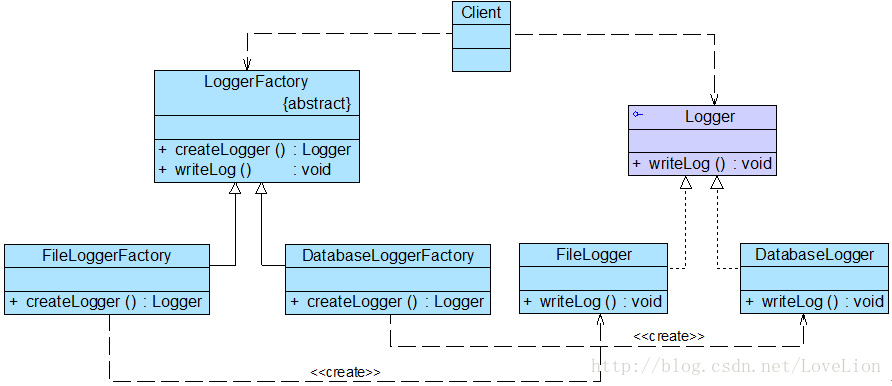

> 下文引用自(https://blog.csdn.net/lovelion/article/details/9306745)
# 工厂方法模式概述
定义一个用于创建对象的接口，让子类决定将哪一个类实例化。工厂方法模式让一个类的实例化延迟到其子类。工厂方法模式又简称为工厂模式(Factory Pattern)，又可称作虚拟构造器模式(Virtual Constructor Pattern)或多态工厂模式(Polymorphic Factory Pattern)。工厂方法模式是一种类创建型模式
在工厂方法模式结构图中包含如下几个角色：
* Product（抽象产品）：它是定义产品的接口，是工厂方法模式所创建对象的超类型，也就是产品对象的公共父类。
* ConcreteProduct（具体产品）：它实现了抽象产品接口，某种类型的具体产品由专门的具体工厂创建，具体工厂和具体产品之间一一对应。
* Factory（抽象工厂）：在抽象工厂类中，声明了工厂方法(Factory Method)，用于返回一个产品。抽象工厂是工厂方法模式的核心，所有创建对象的工厂类都必须实现该接口。
* ConcreteFactory（具体工厂）：它是抽象工厂类的子类，实现了抽象工厂中定义的工厂方法，并可由客户端调用，返回一个具体产品类的实例。

# 工厂方法模式结构图

# 简化的工厂方法模式
有时候，为了进一步简化客户端的使用，还可以对客户端隐藏工厂方法，此时，在工厂类中将直接调用产品类的业务方法，客户端无须调用工厂方法创建产品，直接通过工厂即可使用所创建的对象中的业务方法。

